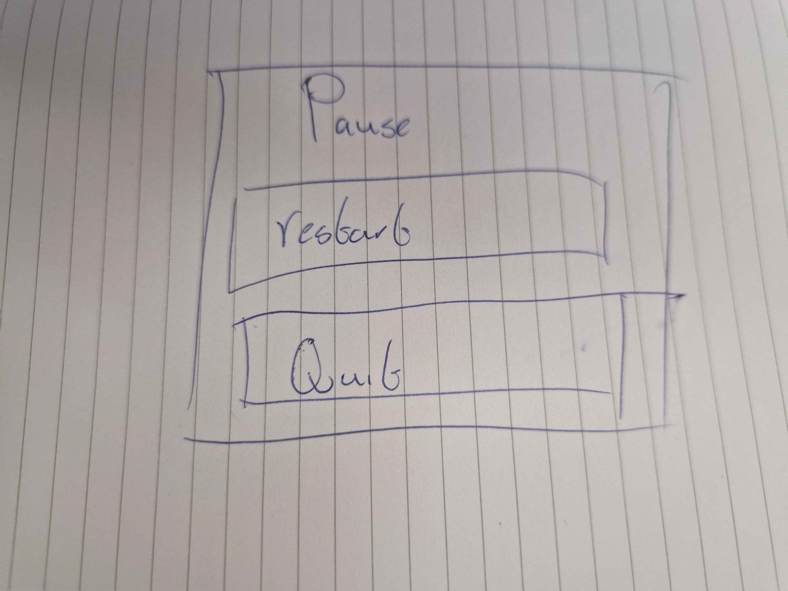
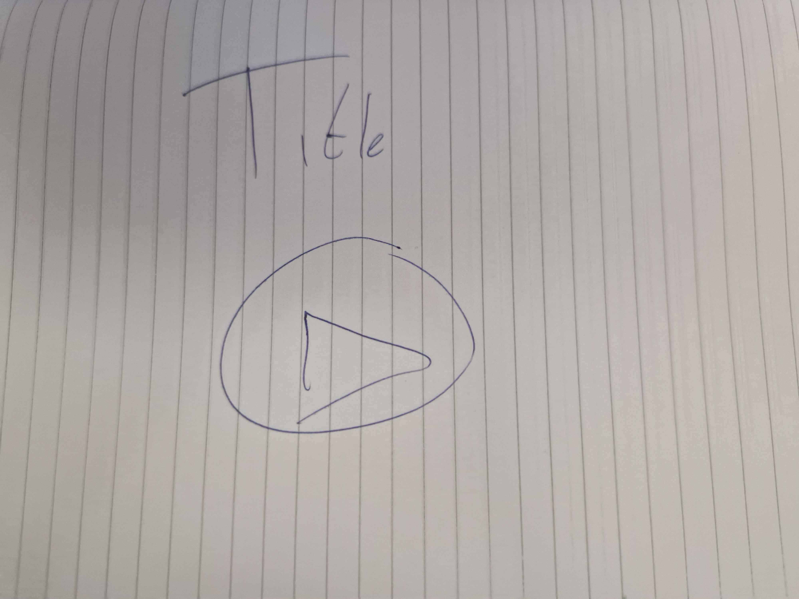

# Sprint 0 - Game Design Document : Tower Defense
Naam: Penny 

Klas: SD2A

Datum: 8-9-2025

## 1. Titel en elevator pitch
Titel: X

Elevator pitch, maximaal twee zinnen:
Mijn game is een tower defense en het gaat leuk zijn. Elke keer al versla je alle enemies gaat de wave met een scale sterker respawnen

## 2. Wat maakt jouw tower defense uniek
Je moet tekenen om sterker te schieten. (Als dit haalbaar is)/Inputs om andere soorten attacks te doen dan standaard.

## 3. Schets van je level en UI
Maak een schets op papier of digitaal en voeg deze afbeelding toe aan je repository. Voeg in deze sectie de afbeelding in.

## 4. Torens
Toren 1 Wizard tower, ongeveer 1x de toren base, Basis dmg: 15 dmg; lightning spell: 5 dmg aan 3 enemies; snow spell: 7.5 dmg en slowt enemies, Basis toren: doet niet veel.

Toren 2 Healer tower, ongeveer 2x de toren base, dmg spell: 5 dmg, basis of buff spell: buffen de andere tower bij 10% en heal spell: wat van de player hp healen(max 10% hp per toren).

Eventuele extra torens: x

## 5. Vijanden
gremlins, 1 tile p second, 100, basis enemy spawnt veel.

ogres, 0.25 tile p second, 1000, boss enemy.

Eventuele extra vijanden: x

## 6. Gameplay loop
Beschrijf in drie tot vijf stappen wat de speler steeds doet.
1. Plaatst torens. 

2. Maakt de torens de spell doen die de speler wilt.

3. Verslaat enemies en krijgt mana

4. volgende wave.

5. eventueel dood

## 7. Progressie

er spawnen meer waves en er komen vaker boss enemies en na ronde 15 gaat de waarde van de enemy omlaag met 10% elke ronden (100 * 0.9 = 90 // 90 *0.9.. etc)

## 8. Risico’s en oplossingen volgens PIO
- Probleem 1: de torens schieten te vaak
- Impact: de waves zijn een stuk makkelijker en de moeilijkheidgraad is erg laag
- Oplossing: de schietrate verminderen

- Probleem 2: de enemies zijn te snel
- Impact: alle enemies maken het tot de basis en je hebt geen mogelijkheid om ze te verslaan
- Oplossing: verminderen van basis speed van de enemy

- Probleem 3: De ui gaat snel kapot 
- Impact: het spel is bijna onspeelbaar
- Oplossing: minder load op de ui zetten
  
## 9. Planning per sprint en mechanics

Sprint 1 mechanics:
Enemies, levens en basis torens.
Meer ability en drag en drop.
Sprint 2 mechanics:
mana en lijstje uitklapbaar maken.
UI af maken.
Sprint 3 mechanics:
overig bugfixes

## 10. Inspiratie

ik dacht niet aan een bestaande td

## 11. Technisch ontwerp mini

### 11.1 Vijandbeweging over het pad
- Keuze: vijanden lopen via waypoints
- Risico: ze kunnen misschien clippen
- Oplossing: geen collider, aanpassen van check distance
- Acceptatie: alle vijanden lopen van start naar einde

### 11.2 Doel kiezen en schieten
- Keuze: towers hebben range en werken met specifieke inputs
- Risico: je kan de towers niet apart switchen 
- Oplossing: ik geef ze een boolean die checkt of ze aan geclickt zijn
- Acceptatie: als alle towers apart van abilities kunnen veranderen en ze niet over de range gaan

### 11.3 Waves en spawnen
- Keuze: ik laat ze spawnen met aan for loop instance
- Risico: er spawnen teveel tegenlijkertijd en de game crasht
- Oplossing: zorgen dat er een limiet is en als dat is bereikt eventueel later nog een wave sturen
- Acceptatie: als alle waves spawnen met een limiet van 100

  
### 11.4 Economie en levens
- Keuze: mana om je torens mee te kopen, als je uit levens ben een game over scherm
- Risico: de levens gaan er niet af, de toren systeem werkt niet 
- Oplossing: checken of het geselecteerd is
- Acceptatie: als je torens apart kan plaatsen en enemies levens nemen die uiteindigen op een game over

### 11.5 UI basis
- Keuze: een lijst die je kan uitklappen met torens die je apart kan selecteren en levens, wave en mana teller.
- Risico: je kan de torens niet selecteren en de tellers werken niet goed, of je kan de ui niet uitklappen
- Oplossing: zorgen dat er een check is wanneer je een muis klik doet op iets en alle code checken of de cijfers er goed in staat. Zorgen dat de UI lijst klikbaar is
- Acceptatie: als je torens kan selecteren en alle tellers doen wat ze horen te doen en je kan het lijstje uitklappen
